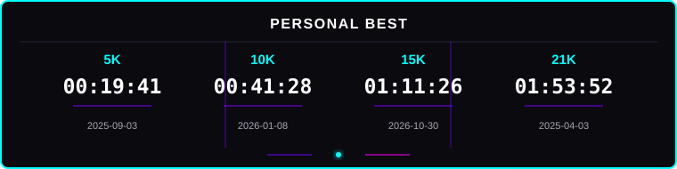

<!-- =========================================================
     MUHAMMAD SYACH FAYRUS
     NEON RGB × MONOSPACE × DEVELOPER × RUNNING
     ========================================================= -->

<!-- =========================================================
     ANIMATED HERO HEADER
     ========================================================= -->

 

<!-- TYPING ANIMATION -->

 

<!-- ANIMATED NEON LINE -->

  

<!-- PROFILE BADGES -->

  

<!-- ANIMATED BOTTOM LINE -->

 

<!-- =========================================================
     ABOUT ME
     ========================================================= -->

## About Me

Hi, I'm **Fayrus**, an Informatics student at **Universitas Jambi** who enjoys learning how software and computer systems work.

I spend most of my time exploring programming, algorithms, data structures, databases, operating systems, and web development — building small projects along the way to understand how things actually work under the hood.

I'm still learning, still experimenting, and still figuring out what I enjoy building the most.

When I'm not coding, you'll probably find me running.

 

<!-- =========================================================
     TECH STACK
     ========================================================= -->

## Tech Stack

  

 

<!-- =========================================================
     CURRENTLY LEARNING
     ========================================================= -->

## Currently Learning

<table width="100%">

<tr>

<td align="center" width="33%">

<b>Data Structures & Algorithms</b>

 

Building intuition for problem solving

</td>

<td align="center" width="33%">

<b>Database Systems</b>

 

Modeling, normalization, and design

</td>

<td align="center" width="33%">

<b>Operating Systems</b>

 

Processes, threads, and memory

</td>

</tr>

<tr>

<td align="center" width="33%">

<b>Object-Oriented Programming</b>

 

Structuring code around real problems

</td>

<td align="center" width="33%">

<b>Web Development</b>

 

Building things people can actually use

</td>

<td align="center" width="33%">

<b>Computer Architecture</b>

 

Understanding how machines execute code

</td>

</tr>

</table>

 

<!-- =========================================================
     PROJECTS
     ========================================================= -->

## Projects

<table width="100%">

<tr>

<td width="50%" valign="top">

### Warehouse Management System

A data processing project involving sorting algorithms, hash tables, and CSV data management.

**Tech:** Python · Algorithms · CSV

 

[View Repository →](#)

</td>

<td width="50%" valign="top">

### Project 02

A project focused on applying programming concepts and problem-solving techniques.

**Tech:** C++ · OOP

 

[View Repository →](#)

</td>

</tr>

<tr>

<td width="50%" valign="top">

### Project 03

An academic project exploring databases, data modeling, and structured information management.

**Tech:** SQL · Database

 

[View Repository →](#)

</td>

<td width="50%" valign="top">

### Project 04

A web development project built while exploring modern web technologies.

**Tech:** HTML · CSS · JavaScript

 

[View Repository →](#)

</td>

</tr>

</table>

 

<!-- =========================================================
     COMPUTER SCIENCE JOURNEY
     ========================================================= -->

## Computer Science Journey

 

 

<!-- =========================================================
     RUNNING
     ========================================================= -->

## Running Enthusiast

### CODE → RUN → RECOVER → REPEAT

Running is part of who I am, not just something I do between coding sessions. I train consistently, chase small improvements in my personal records, and treat long-distance running as its own kind of discipline — one that pairs well with debugging late at night.

 

<!-- =========================================================
     PERSONAL BEST
     ========================================================= -->

## Personal Best

  

<h3>
Coding teaches me to solve problems. 
Running teaches me to keep going.
</h3>

 

<!-- =========================================================
     GITHUB STATS
     ========================================================= -->

## GitHub

 

<!-- =========================================================
     CONNECT WITH ME
     ========================================================= -->

## Connect With Me

&nbsp;&nbsp;&nbsp;

  

 

RUN • CODE • BUILD • REPEAT

 

<!-- =========================================================
     FOOTER
     ========================================================= -->

 

Building, learning, running, and improving — one step at a time.

